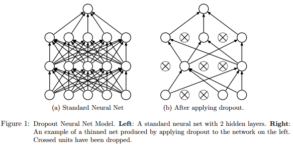

Dropout-A Simple Way to Prevent Neural Networks from Overfitting
=============================================================
文章参考Benjio的论文：Dropout-A Simple Way to Prevent Neural Networks from Overfitting

[TOC]
####1.概述
Dropout主要用来解决深度学习中因大量参数而导致的过拟合问题。他的主要思想是：在训练过程中，随机扔掉一些神经元（包括他们的连接），这样会阻止神经元间的过分的共适应。

####2.深度学习的过拟合
深度神经网络含有大量非线性隐含层，使得模型表达能力非常强。在有限的训练数据下，导致学习了很多样本噪声的复杂关系，而测试样本中可能并不存在这些复杂关系。这就导致了过拟合，目前有很多方法用于减小过拟合：  
1）增加validation set，如果在validation set上效果变差，停止训练；
2）weight penalties， 比如L1和L2正则化限制；
3）soft weight sharing；

在计算能力无限大的情况下，最好的“正则化”方法是根据所有可能的设置（根据训练数据得到的后验概率设置）设定参数，之后平均化这些预测值【Ensemble的方法】。但是，训练不同结构的深度神经网络是非常难的，而且计算量非常大、需要非常大的训练集。

####3.dropout
dropout主要解决以上所说的问题，dropout的意思是drop out 神经网络中的一些神经元（隐含层和可见层）。drop神经元，指随机的从网络中移除，同时包括该神经元的输入和输出，如下图所示。

drop的神经元是随机的，且概率独立，概率p可以通过交叉验证来得到，也可以简单的设置为0.5；在分类问题中，使用dropout比传统的正则化方法，泛化误差都有显著的减小。
论文中提到了很多实验结果。其中，在Street View House Numbers例子中，使用卷积神经网络，提到：仅对MLP层做drop out的效果没有对所有层均做drop out效果好，此外，还提到了使用max-out效果会更加提升。但是，作者提到了这种提升并不显著（卷积层是否使用dropout），这可能是因为卷积神经网络本身参数就少的原因。然而，对于全连接层使用dropout还是能够很好的阻止噪声的干扰从而阻止过拟合。

####4.其他trick
在文章中，还提到了其他的trick。
